# Sonara - Music Player App

Sonara is a React Native music player built with Expo and TypeScript, powered by the JioSaavn API for real-time 
song, album, artist, and playlist discovery. It features a polished dark UI, synchronized mini and full player 
experience, search with debouncing, and a scalable architecture using React Navigation, Zustand, and local 
persistence.

## What Does This Do?

Sonara is a mobile music app where users can:

- **Search** for songs, albums, artists, and playlists with real-time results
- **Play music** with a mini player and full-screen player experience
- **Browse** trending content on the home screen
- **Create and manage** playlists and add songs to them
- **Download** songs for offline listening
- **Adjust settings** such as audio quality, data saver, and notifications

---

## Demo Video
https://github.com/user-attachments/assets/fcc3fe19-ffed-47c2-9831-a6a270e0ec02

## Demo Screenshots

<p align="center">
  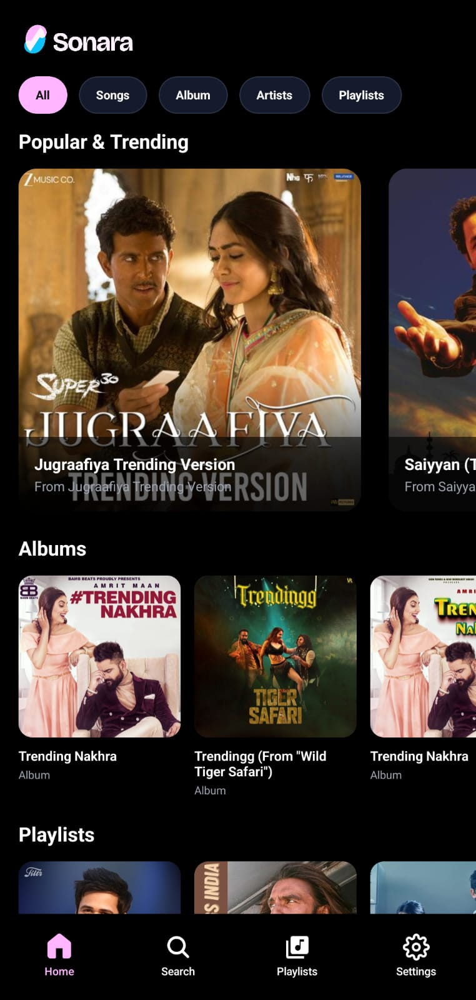
  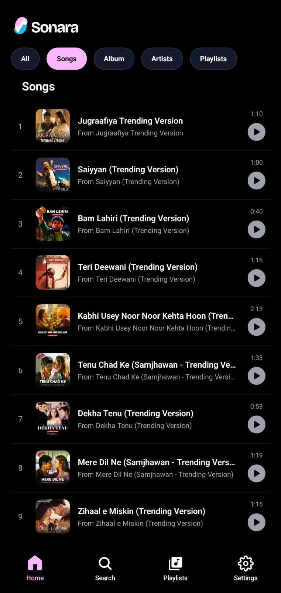
  
  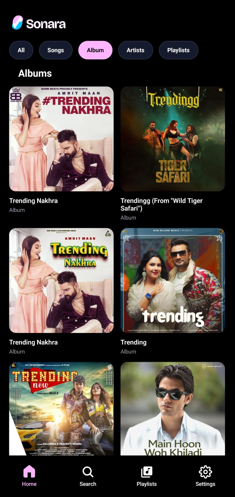
  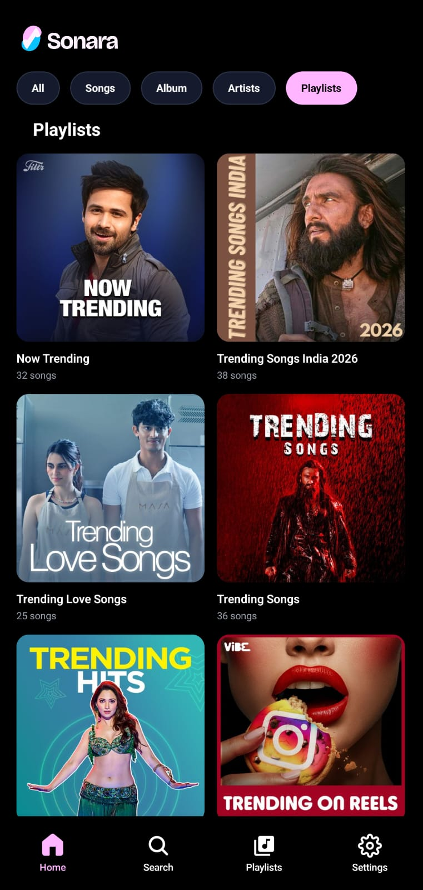
  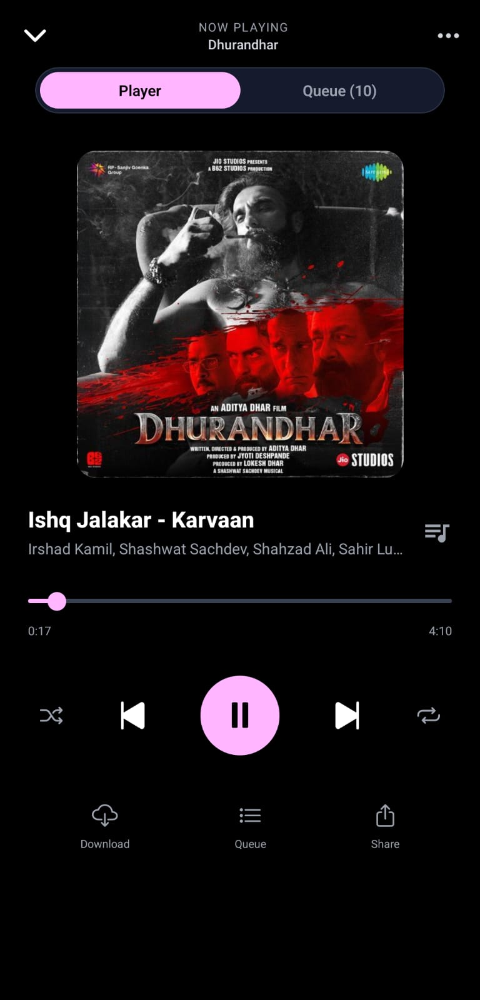
  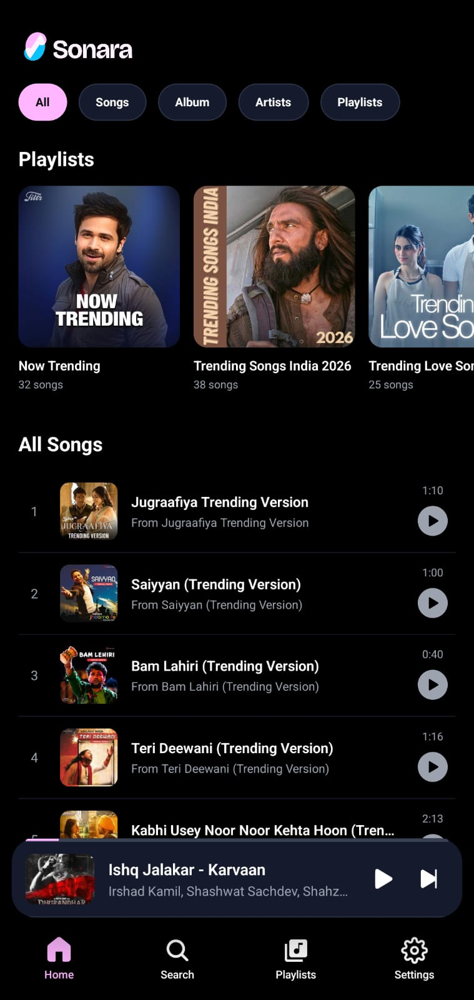
  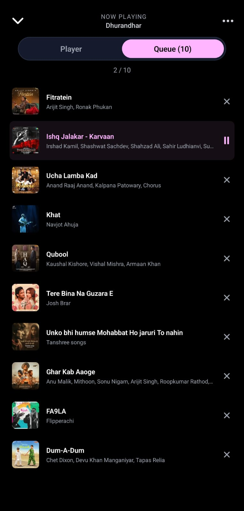
  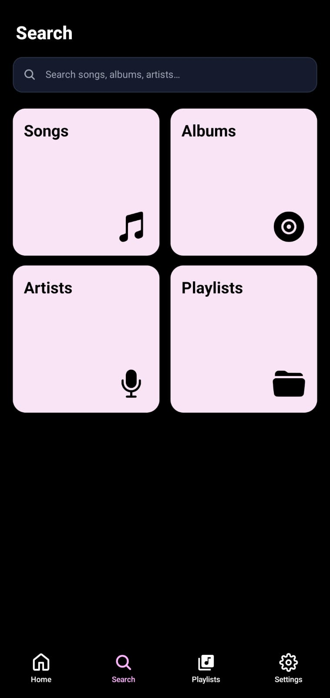
  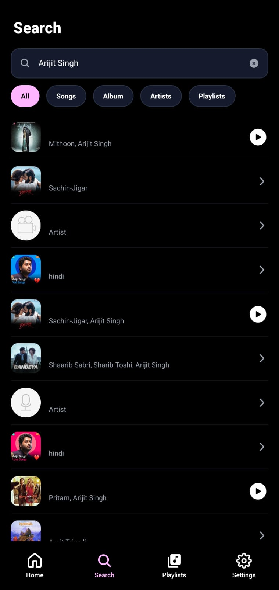
  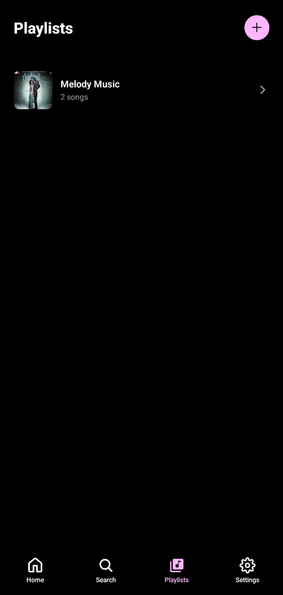
  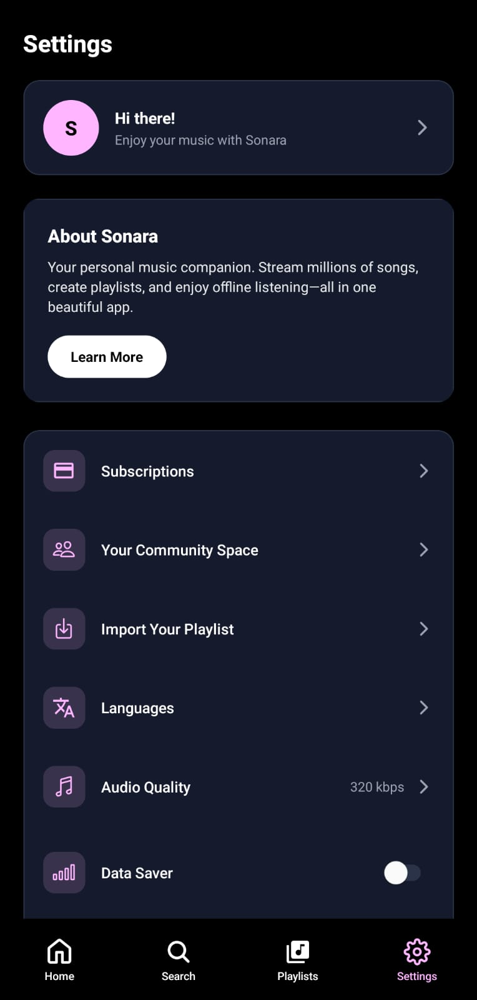
</p>


## Setup

**Prerequisites:** Node.js 18+, npm or yarn or bun 

1. **Install dependencies**

   ```bash
   cd lokal
   npm install
   ```

2. **Configure the API base URL**

   The app talks to a backend that proxies JioSaavn-style search and streaming APIs. Set the base URL in `lokal/src/api/client.ts` or via environment variables (e.g. `EXPO_PUBLIC_SAAVN_BASE_URL`). Without this, search and playback will fail.

3. **Run the app**

   ```bash
   bun start
   ```

   Then press `a` for Android, `i` for iOS, or `w` for web.

4. **EAS Build (APK/AAB)**

   For `eas build`, the API URL is set in `eas.json` (preview/production profiles). The `.env` file is gitignored and not uploaded to EAS. To use a different API URL, edit the `env.EXPO_PUBLIC_BASE_API_URL` in `eas.json` or set it in the [EAS dashboard](https://expo.dev) under Project → Environment Variables.

   If the app icon still shows the default after changes, run: `eas build --platform android --profile preview --clear-cache`

---

## Architecture

- **Framework:** Expo (SDK 54) with React Native
- **Routing:** React Navigation (file-based, stack + tabs)
- **State:** Zustand stores for player, queue, playlists, and downloads
- **Audio:** `expo-av` with a singleton `AudioService` that loads streams and drives playback
- **API:** Thin client in `src/api/` calling a backend (search, songs, albums, artists, playlists)

**Layout:**

```
app/
  _layout.tsx          # Root stack, theme, splash
  (tabs)/              # Tab bar: Home, Search, Playlists, Settings
  player/              # Full-screen player modal
  album/[id]           # Album detail
  playlist/[id]        # Playlist detail

src/
  api/                 # API client and endpoints
  components/          # UI components
  hooks/               # useSearch, useDebounce, useAudioPlayer
  store/               # Zustand (player, queue, downloads, playlists)
  services/            # AudioService singleton
  types/               # TypeScript types
```

**Flow:** User searches → `useSearch` calls API → results shown → tap song → `setQueue` + `setCurrentSong` → `AudioService.loadAndPlay` → `expo-av` plays stream.

---

## Trade-offs

| What | Better | Trade-offs |
|------|--------|------------|
| **State** | Zustand is lightweight, minimal boilerplate, works outside React | Less ecosystem than Redux; no built-in devtools |
| **Audio** | Single `AudioService` instance shared everywhere; no duplicate playback | Harder to test; global state can be tricky to mock |
| **API** | Backend proxy keeps keys and logic server-side; app stays thin | Requires a running backend; no offline-first without extra work |
| **Search** | Debounced (450ms) reduces API calls while typing | Slight delay before results appear |
| **Routing** | Expo Router is file-based, typed, fits Expo well | Tied to Expo; less flexible than custom setup |
| **Auth** | Backend can handle auth if needed | App has no built-in auth; assumes backend or future work |

---

## Scripts

| Command | Description |
|---------|-------------|
| `npm start` | Start Expo dev server |
| `npm run android` | Run on Android |
| `npm run ios` | Run on iOS |
| `npm run web` | Run in browser |
| `npm run lint` | Run ESLint |
